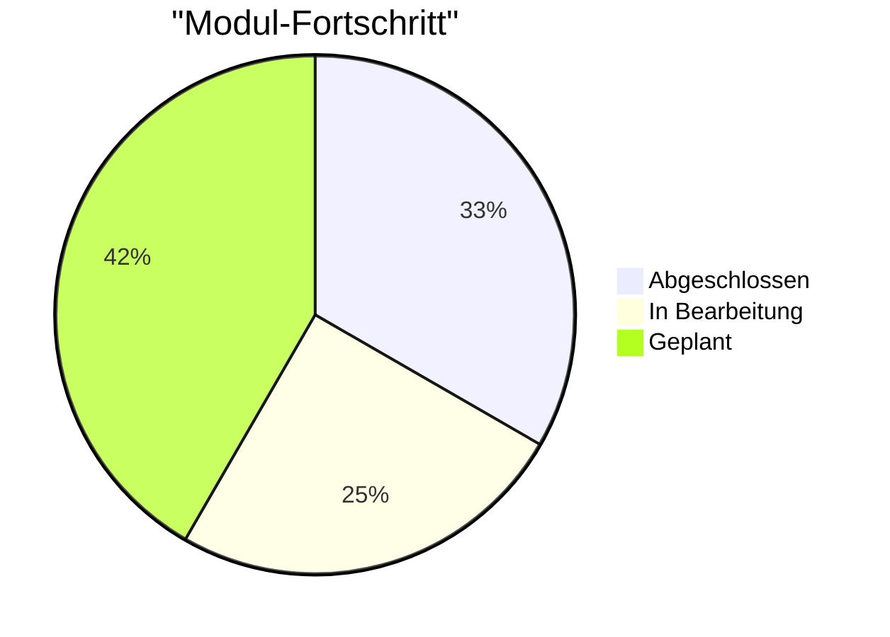

# HTML - HyperText Markup Language

Handlungskompetenz A

HTML ist die Grundlage jeder Webseite. In diesem Modul lernst du, wie du strukturierte und semantische Webseiten erstellst.

## 📖 Modulübersicht

### 1. Struktur
Grundlagen

Lerne die Basis-Struktur von HTML-Dokumenten kennen.

- [Grundgerüst](01-Struktur/01-Grundgeruest.md) - Die Basis jeder HTML-Seite
- [Erste Inhalte](01-Struktur/02-Erste-Inhalte.md) - Text und Überschriften
- [Semantik](01-Struktur/03-Semantik.md) - Bedeutungsvolle HTML-Elemente

### 2. Text
Formatierung

Formatiere und strukturiere Textinhalte professionell.

- [Über mich](02-Text/01-Ueber-mich.md) - Persönliche Seite erstellen
- [Formatierung](02-Text/02-Formatierung.md) - Text stylen
- [Listen](02-Text/03-Listen.md) - Geordnete und ungeordnete Listen

### 3. Links & Bilder
Multimedia

Verknüpfe Seiten und binde Medien ein.

- [Navigation](03-LinksBilder/01-Navigation.md) - Interne und externe Links
- [Bilder](03-LinksBilder/02-Bilder.md) - Bilder optimal einbinden
- [Projekt Galerie](03-LinksBilder/03-Projekt-Galerie.md) - Bildergalerie erstellen

## 🎯 Lernziele

Nach diesem Modul kannst du:

- [x] HTML-Dokumente korrekt strukturieren
- [x] Semantische HTML5-Elemente verwenden
- [x] Text professionell formatieren
- [ ] Bilder und Medien einbinden
- [ ] Barrierefreie Webseiten erstellen

!!! success "Best Practices"
    - Verwende immer semantische HTML-Elemente
    - Validiere deinen Code mit dem [W3C Validator](https://validator.w3.org/)
    - Denke an Barrierefreiheit (Accessibility)

## 📊 Fortschritt

---

**Bereit anzufangen?** Starte mit dem [Grundgerüst](01-Struktur/01-Grundgeruest.md)! 🚀